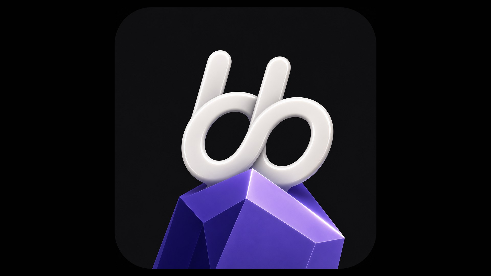
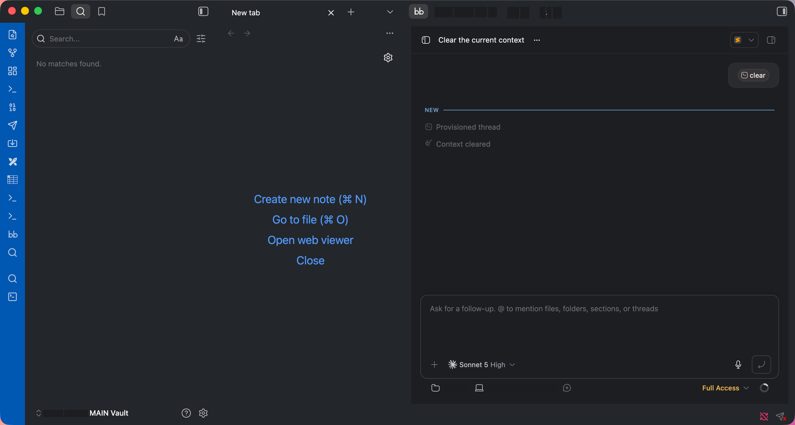

# bb - AI agentic IDE

Embeds [bb](https://github.com/get-bb/bb) — a local AI agentic IDE with a desktop app — inside an Obsidian tab or sidebar, via its local web interface.

**Requires the [bb desktop app](https://github.com/get-bb/bb) to be installed.** This plugin has no functionality on its own — it is a thin wrapper around bb's local UI, for people who already use bb.

## What it does

- Ribbon icon and **Open bb** command open bb as a tab (or sidebar) inside Obsidian.
- **Where to open** setting: main area / left sidebar / right sidebar.
- If bb's local server isn't responding, quietly launches the bb desktop app in the background; if bb isn't installed, shows a notice with a copyable `npx bb-app@latest` install command.
- Optionally sets provider / model / permission mode defaults for the bb project that matches the current vault path, if that project already exists in bb.
- Zoom control (50–200%) for the embedded view.

## Network requests and local data access

This plugin only ever talks to your own machine — it makes no requests to any remote server:

- It loads a `<webview>` pointed at `http://localhost:38886` by default (configurable), which is bb's own local HTTP interface served by the bb desktop app.
- If that local address doesn't respond, it runs `open -g -b dev.bb.desktop` to launch the bb app in the background.
- If the "set project defaults" setting is on, it reads and writes bb's local SQLite database at `~/.bb/bb.db` (via the `sqlite3` CLI) to look up the bb project matching the current vault path and set its default provider/model/permission mode.

## Reviewer notes: shell access and clipboard

Two automated-review warnings apply to this plugin. Both are intentional, and both are scoped to the user's own machine:

- **Shell execution (`child_process`)** — used in exactly three places, all with fixed, non-user-controlled arguments:
  - `exec("open -g -b dev.bb.desktop")` launches the bb desktop app in the background when its local server is not responding (macOS only; this plugin is desktop-only).
  - `execFile("sqlite3", [...])` reads and writes `~/.bb/bb.db` to set the per-project provider/model/permission defaults. The SQL is built from the current vault path (single-quote escaped) and the plugin's own settings — no arbitrary command execution.
- **Clipboard access** — only when the user clicks the `npx bb-app@latest` code snippet in the "bb not found" notice, to copy that install command. Nothing else is read from or written to the clipboard.

No telemetry and no remote requests: the only network target is bb's local web interface on `localhost`.

## Settings

- **bb URL** — local address of bb's web interface.
- **Auto-launch bb.app** — launch bb in the background if its server isn't running.
- **Set project defaults on open** — sync provider/model/permission mode into bb for this vault's project.
- **Always open a new tab** — vs. reusing/reloading an existing bb tab.
- **Where to open the bb tab** — main area, left sidebar, or right sidebar.
- **Provider / Model / Permission mode** — the defaults applied when syncing.
- **Font size (zoom)** — zoom level of the embedded view.

## Manual installation

1. Download `main.js`, `manifest.json`, and `styles.css` from the [latest release](../../releases/latest).
2. Copy them into `<vault>/.obsidian/plugins/bb-ai-agent/`.
3. Reload Obsidian, then enable `bb - AI agentic IDE` under Settings → Community plugins.

## License

MIT
